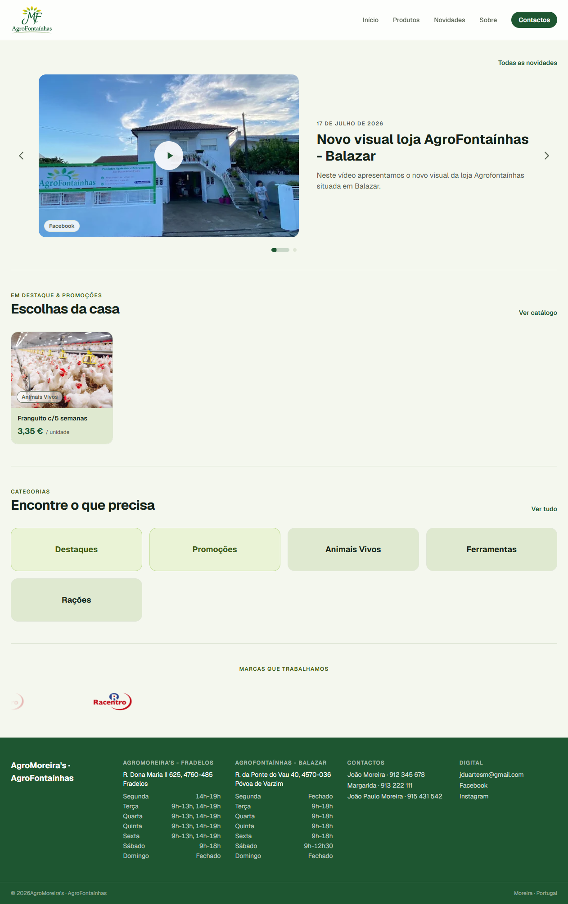
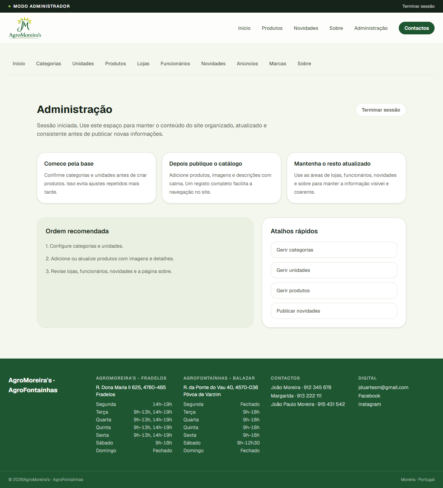

# AgroMoreira Web

**Storefront and admin panel for a farm & animal supplies business**

The public website and private management panel for a two-store agricultural
business, built with Next.js 16 (App Router) and React Server Components. It
renders the product catalogue, a news feed, store contacts and an "about us"
page for visitors — and gives the owners a full admin area to manage all of it.
Data comes from the [Agromoreira API](../agromoreira-api); the design is a
light-only, brand-tinted system derived from the company's logo.


**Live:** <https://agromoreira.vercel.app/>

[](https://agromoreira.vercel.app/)

<sub>*The public homepage — news carousel, featured & on-sale products, category shortcuts and the partner-brand marquee.*</sub>

---

## Table of Contents

- [Overview](#overview)
- [Site Map](#site-map)
- [Design System](#design-system)
- [Tech Stack](#tech-stack)
- [Architecture](#architecture)
- [Getting Started](#getting-started)
- [Project Structure](#project-structure)
- [The Admin Panel](#the-admin-panel)
- [Configuration](#configuration)
- [Development](#development)
- [Deployment](#deployment)
- [Design Decisions](#design-decisions)

---

## Overview

This is the **front-end half** of the Agromoreira project. It is not a
standalone app: every piece of content — products, prices, photos, opening
hours, news — lives in the [API](../agromoreira-api) and its database. This
repository is purely presentation and interaction.

It has **two faces**:

| | Public site | Admin panel |
| --- | --- | --- |
| Who | Any visitor | The owners, after login |
| Where | `/`, `/produtos`, `/novidades`, … | `/admin/*` |
| Purpose | Browse the catalogue, find a store, read news | Create / edit / hide everything the public sees |
| Auth | None | JWT in an httpOnly cookie |
| Language | Portuguese (`pt-PT`) | Portuguese (`pt-PT`) |

The site is **informational, not e-commerce**: there is no cart, no checkout and
no stock. A visitor browses products and calls the shop. So the front-end's job
is to look trustworthy, load fast, and make the catalogue easy to scan.

### What it does

- **Homepage** — latest news carousel, featured & on-sale products, category
  shortcuts, and a scrolling strip of partner brands.
- **Catalogue** — filterable product grid with a sticky category sidebar, plus
  two code-defined "virtual" categories (*Destaques*, *Promoções*).
- **Product detail** — image gallery, price (with discount), the selling unit,
  and which of the two stores carries it.
- **News feed** (*Novidades*) — a blog-like list of posts mixing text, photos,
  YouTube and Facebook videos, and Instagram links.
- **Contacts** — the staff directory and both stores with addresses and opening
  hours.
- **About** — institutional text, social links and a presentation video.
- **Admin panel** — ten management sections behind a login, with inline editing
  shortcuts that appear on the public site while signed in.

---

## Site Map

```
Public
├── /                     Homepage — news carousel, highlights, categories, brands
├── /produtos             Catalogue — grid + sticky category sidebar + filters
│   └── /produtos/[id]    Product detail — gallery, price, stores
├── /novidades            News feed
│   └── /novidades/[id]   Post detail — with inline video / photo
├── /categorias           All categories
├── /contactos            Staff directory + stores + opening hours
└── /sobre                About us

Admin  (gated — /admin/*)
├── /admin/login          Sign in (the only ungated admin route)
├── /admin                Panel home
├── /admin/categorias     Categories
├── /admin/unidades       Selling units
├── /admin/produtos       Products (+ image editor, featured, hide)
├── /admin/lojas          Stores + opening hours
├── /admin/funcionarios   Staff & contacts
├── /admin/novidades      News posts
├── /admin/anuncios       Announcements (holiday closures, …)
├── /admin/marcas         Partner brands (homepage marquee)
└── /admin/sobre          About-us content
```

**19 pages**, **28 components**, driven by the public API endpoints plus the full
admin surface behind the token.

---

## Design System

The whole look is derived from the two company logos: a **forest-green** brand
with a **lime-green leaf** accent. The palette lives in one place —
[app/globals.css](app/globals.css), declared inside Tailwind v4's `@theme` block
— so every colour is available as a utility (`bg-primary`, `text-accent`,
`border-line`, …) and there are no stray hex values scattered across components.

### Palette

| Token | Hex | Role |
| --- | --- | --- |
|  `primary` | `#1e5631` | Forest green — buttons, headings, nav |
|  `primary-deep` | `#123b21` | Hover / darker green |
|  `accent` | `#8dbe3d` | Lime (the leaf) — highlights, sale tags |
|  `accent-soft` | `#eaf3d6` | Lime tint — notice banners |
|  `accent-ink` | `#3c5a16` | Readable green on lime |
|  `ink` | `#16231a` | Main text |
|  `ink-soft` | `#55604f` | Secondary text |
|  `line` | `#dfe6d6` | Hairlines / borders |
|  `mist` | `#dfe9d0` | Panels, image placeholders |

The page background is a soft green-tinted off-white (`#f4f7ee`) rather than pure
white, so cards and photos lift off the page.

### Typography

[Geist Sans](https://vercel.com/font) for everything, Geist Mono kept available,
both loaded and self-hosted through `next/font` — no layout shift, no external
font request. Prices render in Portuguese format (`18,90 €`) and dates in full
(`15 de julho de 2026`) via `Intl`, in [lib/format.ts](lib/format.ts).

### Motion

Four hand-written CSS animations give the site life without a motion library —
all defined in [app/globals.css](app/globals.css), and **all disabled under
`prefers-reduced-motion`**:

| Animation | Where | What |
| --- | --- | --- |
| **Logo crossfade** | Header | The two company logos fade into one another on a 12 s loop |
| **Carousel progress** | Homepage news | The active dot fills over the autoplay duration, then advances; freezes on hover / drag / video |
| **Announcement fade** | Top bar | Each rotated notice fades in as it changes |
| **Brand marquee** | Homepage footer | A continuously scrolling, edge-masked strip of partner logos; pauses on hover |

### Layout & responsiveness

- A **sticky header** (`bg-white/85` + `backdrop-blur`) with an animated
  underline on nav links and *Contactos* styled as a pill button; collapses to a
  hamburger menu on mobile.
- Content is capped (`max-w-[1800px]`, cards ~200px) so grids add columns on wide
  screens instead of stretching.
- `scrollbar-gutter: stable` reserves the scrollbar's width on every page, so the
  centred header never shifts sideways between a short and a tall page.
- A single CSS variable, `--catalogue-offset`, is computed in the root layout
  from whether the admin bar is showing, so every sticky element (header,
  sidebar, catalogue) shares one correct offset without re-checking the session.

---

## Tech Stack

| Package | Version | Role |
| --- | --- | --- |
| [Next.js](https://nextjs.org) | 16.2 | App Router, Server Components, Server Actions |
| [React](https://react.dev) | 19.2 | UI |
| [TypeScript](https://www.typescriptlang.org) | 5 | Types end to end |
| [Tailwind CSS](https://tailwindcss.com) | v4 | Styling, design tokens via `@theme` |
| [openapi-typescript](https://github.com/openapi-ts/openapi-typescript) | 7 | Generates API types from the backend's OpenAPI schema |
| [ESLint](https://eslint.org) | 9 | Linting (`eslint-config-next`) |
| pnpm | 10 | Package manager |
| Node.js | ≥ 20 | Runtime |

> **Note — this is Next.js 16.** Some conventions differ from earlier versions:
> the request gate lives in [proxy.ts](proxy.ts) (not `middleware.ts`), and
> server-side APIs like `cookies()` and `headers()` are async. See
> [AGENTS.md](AGENTS.md).

---

## Architecture

### Rendering & data flow

Pages are **async React Server Components**: they `await` their data on the
server and stream finished HTML to the browser. There is no client-side data
store and no loading spinner on first paint — the page arrives populated.

```
   Browser
      │  request
      ▼
┌───────────────────────────────────────────────┐
│  Next.js (App Router, on the server)          │
│                                               │
│  Server Component ─── await getProducts() ──┐ │
│                                             │ │
│  Server Action  ─── adminFetch(POST …) ───┐ │ │
└───────────────────────────────────────────┼─┼─┘
                                            │ │  JSON
                                            ▼ ▼
                              ┌──────────────────────────┐
                              │  Agromoreira API         │
                              │  (FastAPI, Cloud Run)    │
                              └──────────────────────────┘

   Browser ──────────────────────────▶ Cloudflare R2
              product / post images     (served directly, never proxied)
```

Images are **not** routed through Next.js — the API returns a ready-to-use
`image_url` pointing straight at object storage, and the browser fetches it
directly.

### The API layer

Everything that talks to the backend goes through [lib/api/](lib/api/), so no
component ever calls `fetch` directly:

| File | Responsibility |
| --- | --- |
| [client.ts](lib/api/client.ts) | `apiFetch<T>()` — prefixes the base URL, sets JSON headers (skipped for `FormData` uploads), and turns error bodies into a typed `ApiError` carrying the HTTP status |
| [queries.ts](lib/api/queries.ts) | One typed function per **public** resource (`getProducts`, `getPosts`, `getStores`, …) |
| [admin.ts](lib/api/admin.ts) | `adminFetch<T>()` — attaches the bearer token and redirects to login on 401; the token-guarded reads (`include_inactive=true`) live here |
| [schema.ts](lib/api/schema.ts) | **Auto-generated** from the API's OpenAPI document — never edited by hand |
| [types.ts](lib/api/types.ts) | Friendly aliases over the generated schema (`Product` instead of `components["schemas"]["ProductRead"]`) |

Because the types are generated from the live API, a breaking change in the
backend shows up as a **TypeScript error** here, not a runtime surprise.
Regenerate with `pnpm gen:api`.

### Authentication

The public site needs no auth. The admin area works like this:

1. **Login** — [a Server Action](app/admin/login/actions.ts) posts the
   credentials to the API's OAuth2 form endpoint, receives a JWT, and stores it
   in an **httpOnly** cookie (`agromoreira_session`, 8 h). httpOnly means
   browser JavaScript cannot read the token, so an XSS flaw cannot steal it.
2. **Gate** — [proxy.ts](proxy.ts) redirects any un-authenticated hit on
   `/admin/*` to the login page. It only checks the cookie is *present*; it does
   not verify the signature. That is deliberate — this is a UX redirect, and the
   real gate is the API, which rejects any request without a valid token.
3. **Requests** — admin mutations run as **Server Actions**, reading the token
   server-side. The password and the token never touch client-side JavaScript.

```
Visitor ──▶ /admin/produtos ──▶ proxy.ts ──┬─ no cookie ─▶ /admin/login
                                            └─ cookie ────▶ page renders
                                                              │
                                            Server Action ────┘ (reads token,
                                                                 calls API,
                                                                 401 → login)
```

---

## Getting Started

### Prerequisites

- **Node.js ≥ 20** and **pnpm 10** (`corepack enable pnpm`)
- The **[Agromoreira API](../agromoreira-api)** running and reachable (locally on
  `http://localhost:8000`). The front-end renders nothing on its own.

### Install & run

```bash
# 1. Install dependencies
pnpm install

# 2. Configure the API URL
cp .env.example .env.local
#    then edit .env.local if the API is not on http://localhost:8000

# 3. (optional) Regenerate the API types — needs the API running
pnpm gen:api

# 4. Start the dev server
pnpm dev
```

Open <http://localhost:3000>. The page hot-reloads as you edit.

The admin panel is at <http://localhost:3000/admin> — sign in with the admin
credentials created by the API's `create_admin` script.

---

## Project Structure

```
app/                         App Router — every folder is a route
├── layout.tsx               Root shell: fonts, header/footer, admin bar, sticky offset
├── globals.css              Tailwind import, design tokens (@theme), all animations
├── page.tsx                 Homepage
├── produtos/                Catalogue + [id] detail
├── novidades/               News feed + [id] detail
├── categorias/ contactos/ sobre/
└── admin/
    ├── login/               Sign-in (outside the panel group)
    └── (panel)/             Route group: shared nav shell for the ten sections
        ├── layout.tsx       Panel navigation
        └── produtos/ lojas/ …   Each section: page.tsx + *Manager.tsx + *Form.tsx + actions.ts

components/                  28 presentational + interactive components
├── Header.tsx  Footer.tsx  AnnouncementBar.tsx  ...   Public chrome
├── ProductCard.tsx  ProductGallery.tsx  PostCarousel.tsx  BrandMarquee.tsx  ...
└── admin/                   Admin-only widgets (AddCard, NameListManager, …)

lib/
├── api/                     The typed API layer (see Architecture)
├── auth.ts                  Session cookie name, TTL, admin paths (no request APIs)
├── format.ts                Price & date formatting (pt-PT)
├── embeds.ts                YouTube / Facebook / Instagram embed helpers
├── opening-hours.ts         Sort store hours Monday → Sunday
└── virtual-categories.ts    Code-defined "Destaques" / "Promoções" collections

proxy.ts                     Request gate for /admin/* (Next.js 16 middleware)
next.config.ts               Server Action body limit (6 MB, for image uploads)
public/logos/                The two brand logos used in the header crossfade
```

Each admin section follows the same shape: a **Server Component** `page.tsx`
fetches the data, a client `*Manager.tsx` holds the interactive list, a
`*Form.tsx` handles create/edit, and `actions.ts` holds the `"use server"`
mutations. Consistent enough that once you have read one section, you have read
them all.

---

## The Admin Panel



<sub>*The panel home while signed in — the `MODO ADMINISTRADOR` bar, the section navigation, and quick-start shortcuts.*</sub>

Behind the login sit **ten management sections**, ordered by dependency
(categories and units exist before a product can reference them; a store before
an employee):

| Section | Manages | Highlights |
| --- | --- | --- |
| Categorias | Product categories | Rename, reorder, delete (blocked if in use) |
| Unidades | Selling units | kg, saco 25kg, unidade, … |
| Produtos | The catalogue | Image editor with cover selection, featured star, hide |
| Lojas | The two stores | Address + weekday opening-hours editor |
| Funcionários | Staff & contacts | Photo, role, which store |
| Novidades | News posts | Text + photo + YouTube/Facebook/Instagram, draft toggle |
| Anúncios | Announcements | Holiday closures and site-wide notices |
| Marcas | Partner brands | Logos for the homepage marquee, ordering |
| Sobre | About-us content | Institutional text, social links, video |

While signed in, the public pages also show **inline editing shortcuts** (an
admin bar, edit stars on product cards, "hidden" badges on drafts), so the owner
can jump straight from what they are viewing to editing it.

Image uploads flow through Server Actions, which Next caps at 1 MB by default;
[next.config.ts](next.config.ts) raises that to 6 MB to match the API's 5 MB
image limit plus multipart overhead — with the API remaining the real gatekeeper.

---

## Configuration

One environment variable, read at build and runtime:

| Variable | Example | Notes |
| --- | --- | --- |
| `NEXT_PUBLIC_API_URL` | `http://localhost:8000` | Base URL of the API. `NEXT_PUBLIC_` makes it available in the browser too. In production it points at the API domain. |

Local values go in `.env.local` (gitignored); `.env.example` is the template.
The client throws a clear error at startup if the variable is missing, rather
than failing on the first request.

---

## Development

```bash
pnpm dev        # dev server with hot reload (http://localhost:3000)
pnpm build      # production build
pnpm start      # serve the production build
pnpm lint       # ESLint (eslint-config-next)
pnpm gen:api    # regenerate lib/api/schema.ts from the API's OpenAPI document
```

`pnpm gen:api` requires the API running on `http://localhost:8000` — it reads
`/openapi.json`. Run it whenever the backend's contract changes; the resulting
type errors will point at exactly what needs updating.

The path alias `@/` maps to the project root (`@/lib/...`, `@/components/...`),
configured in [tsconfig.json](tsconfig.json).

---

## Deployment

A standard Next.js production build (`pnpm build`) — deployable to any Node host
or edge platform that runs Next.js 16. The only required configuration is
`NEXT_PUBLIC_API_URL` pointing at the deployed [API](../agromoreira-api) (which
runs on Google Cloud Run).

Because product and post images are served directly from object storage — not
through Next.js — the front-end stays light: it renders HTML and forwards a
handful of JSON calls, and does no media proxying.

---

## Design Decisions

Why the front-end is built the way it is.

- **Server Components by default.** The catalogue is read-heavy and public.
  Fetching on the server means the browser receives finished HTML with no
  client-side data layer, no waterfall of requests, and good SEO — the visitor
  sees products, not a spinner.

- **Types generated from the API, never written twice.** `pnpm gen:api` turns the
  backend's OpenAPI schema into TypeScript. A field that changes shape on the API
  becomes a compile error here, so the two halves of the project cannot silently
  drift apart.

- **The token lives in an httpOnly cookie, not `localStorage`.** It is set and
  read only by server code, so client-side JavaScript — and therefore any XSS
  payload — can never reach it.

- **The proxy gate is a courtesy, not the wall.** It cannot verify the JWT (the
  signing secret belongs to the API). It only avoids showing the panel to someone
  with no session; the API is what actually refuses the data. Keeping the real
  authority in one place avoids two systems disagreeing about who is allowed in.

- **Light-only, on purpose.** The brand is a green-on-white identity. A dark theme
  would mean maintaining a second palette and re-checking every photo and logo
  against a dark background, for a shop-window site where it adds little. The
  tokens are centralised, so adding one later is a contained change if it is ever
  wanted.

- **Motion is CSS, and always optional.** Every animation is a keyframe in one
  stylesheet with a `prefers-reduced-motion` fallback — no animation library ships
  to the browser, and no visitor who asked for less motion gets more.

- **"Virtual" categories.** *Destaques* and *Promoções* behave like categories in
  the UI but are computed rules (featured / on sale), not database rows. They
  always exist, never need a product assigned, and can't be deleted by mistake in
  the admin — see [lib/virtual-categories.ts](lib/virtual-categories.ts).

---

## Related

- **[agromoreira-api](../agromoreira-api)** — the FastAPI backend, database and
  object storage this front-end consumes. Its README covers the data model,
  endpoints and deployment.

---

## Licence

Private project.
